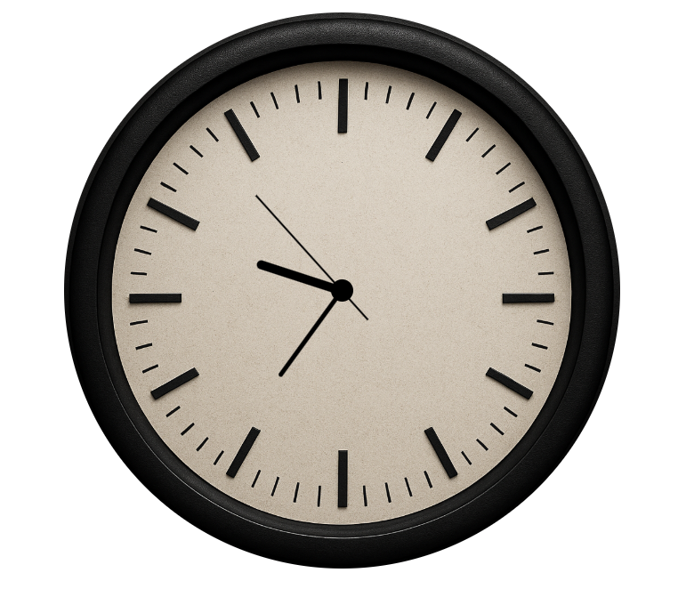

# simple Analog Clock (JavaScript)

A simple and minimal analog clock built using plain **HTML, CSS, and JavaScript**.  
This was a personal mini-project to practice working with the **Date object** and **DOM manipulation**.

---

## Screenshot

---

## Live Demo

**[Click here to see the time](https://aminbaniamer.github.io/analog-clock/)**

---

## Features

- Real-time clock updates using JavaScript
- Rotating hands with `transform: rotateZ()`
- Lightweight – no external libraries or frameworks

---
